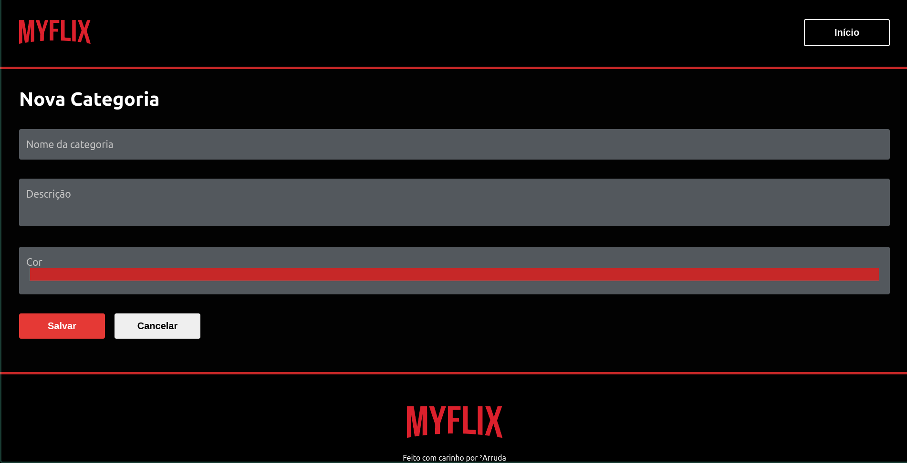

<h1 align="center">
    <a href="https://aluraflix-andre23arruda.vercel.app" target="_blank">
        
    </a>
</h1>

<h4 align="center">
  📺 MYFLIX
</h4>


<p align="center">
  <a href="#-tecnologias">Tecnologias</a>&nbsp;&nbsp;&nbsp;|&nbsp;&nbsp;&nbsp;
  <a href="#-projeto">Projeto</a>&nbsp;&nbsp;&nbsp;|&nbsp;&nbsp;&nbsp;
  <a href="#instalação">Instalação</a>&nbsp;&nbsp;&nbsp;|&nbsp;&nbsp;&nbsp;
  <a href="#telas">Telas</a>&nbsp;&nbsp;&nbsp;|&nbsp;&nbsp;&nbsp;
  <a href="#exemplo">Exemplo</a>
</p>


## 🚀 Tecnologias

Esse projeto foi desenvolvido com as seguintes tecnologias:

- [Next.js](https://nextjs.org/)


## 💻 Projeto
**MYFLIX é uma aplicação para você cadastrar seus vídeos preferidos do Youtube e salvá-los por categoria  📺 **

## Instalação
### Pré requisitos
Ter instalado:
- [Node](https://nodejs.org/en/download/)
- [Yarn](https://classic.yarnpkg.com/en/docs/install/)

```sh
# Clonar repositório
git clone https://github.com/andre23arruda/aluraflix.git

# Instalar os pacotes do projeto
yarn install

# Run
yarn dev
```

## Telas
<div align="center">
    
</div>
<p align="center">Home</p>
<hr>

<div align="center">
    
</div>
<p align="center">New Video</p>
<hr>

<div align="center">
    
</div>
<p align="center">New Category</p>


## Exemplo
<a href="https://aluraflix-andre23arruda.vercel.app" target="_blank">Visitar</a>
